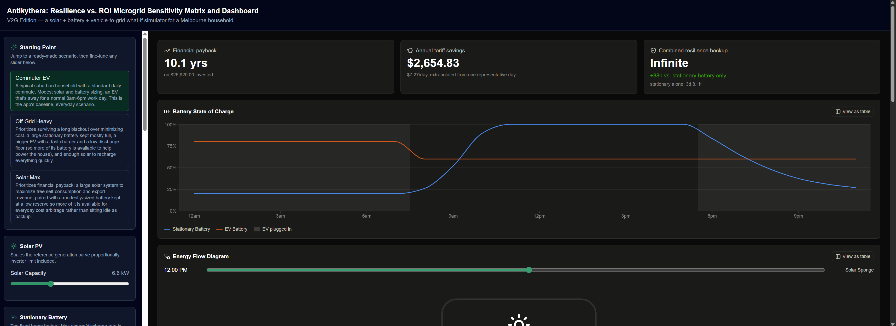
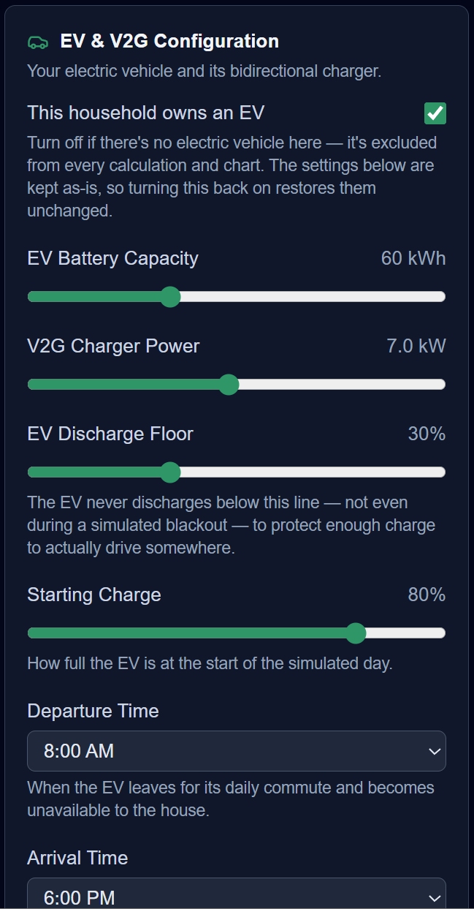
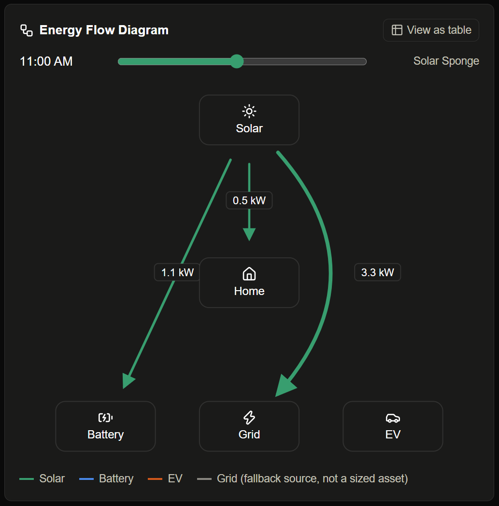
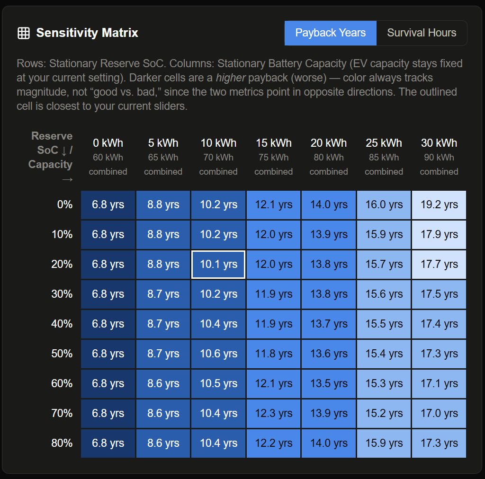
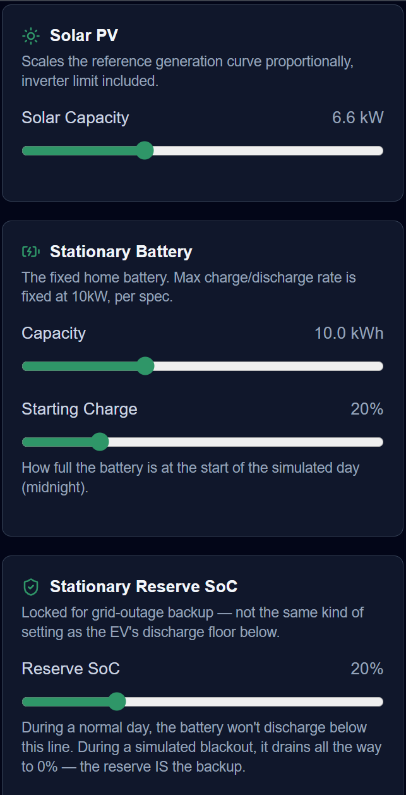
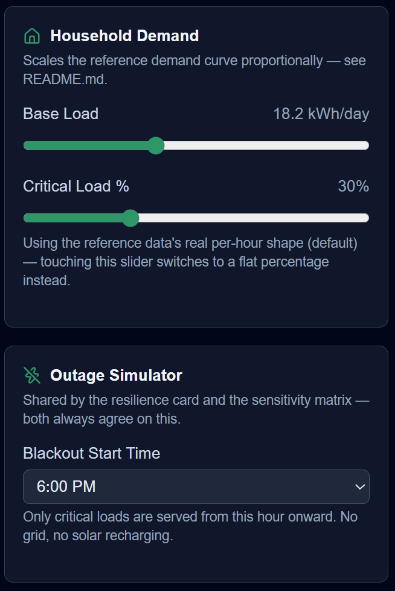

# ANTIKYTHERA: A V2G Resilience Simulator

Answers the two questions every solar-battery-EV buyer actually asks — "how fast does this pay for itself?" and "how long does it keep the lights on when the grid doesn't?" — from one set of live sliders, no backend required.



**Live demo:** https://project-antikythera.vercel.app

## Overview

This is a client-side dashboard that simulates a household's solar + stationary battery + bidirectional-EV ("V2G" — Vehicle-to-Grid, meaning the car can discharge back into the house, not just draw from it) microgrid against a real Melbourne time-of-use tariff. Every slider move re-runs a full 24-hour dispatch simulation and recomputes financial payback, annual savings, and blackout-survival hours instantly, entirely in the browser. A companion sensitivity matrix shows how battery reserve level and size trade off cost payback against outage resilience — the two goals usually pull in opposite directions, and the matrix makes that tension visible rather than collapsing it into one number.

This project is also built incrementally as a hands-on learning and exploration process of Claude Code's capabilities.

## Features

- **Instant what-if exploration** — drag any of ~15 battery, EV, solar, or load inputs and every chart, card, and table recalculates live. No save button, no server round-trip.
- **Real tariff modeling, not a flat rate** — Off-Peak, Solar Sponge, and Evening Peak pricing (import *and* export rates differ per period), so the savings number reflects when energy is used, not just how much.
- **Payback and savings projection** — capex for battery, solar, and V2G charger vs. a no-equipment baseline, reduced to a single years-to-payback figure.
- **Blackout resilience estimate** — simulate a grid outage starting at any hour and see how long (in days and hours) the batteries can carry *critical* load (fridge, essential circuits), with and without the EV's help — shown as "Infinite" once a scenario outlasts the simulation's one-week cap.
- **Optional EV** — no electric vehicle? Toggle EV ownership off and it's excluded from every calculation, chart, and diagram (no V2G charger cost, no EV line on the battery chart, no EV node on the flow diagram) — your EV settings are kept as-is underneath, so turning it back on restores them unchanged.
- **Dual-battery state-of-charge chart** — stationary battery and EV battery plotted as two independent lines across the day, each with a table-view fallback.
- **Energy flow diagram** — a live snapshot of where power is moving (Solar → Home, Battery → Home, Grid → Home, etc.) for any hour of the simulated day.
- **Reserve vs. size sensitivity matrix** — a heat-mapped grid of Reserve SoC% against Battery Capacity, showing payback years and survival hours for every combination at once.
- **Three starting presets** — Commuter EV, Off-Grid Heavy, and Solar Max — so the tool is useful in one click before anyone touches a slider.

## Screenshots

<table>
  <tr>
    <td align="center" width="50%">
      <br>
      <strong>Optional EV</strong> — turn EV ownership on or off; every calculation and chart adjusts automatically.
    </td>
    <td align="center" width="50%">
      <br>
      <strong>Energy Flow Diagram</strong> — a live, hour-by-hour snapshot of where power is moving.
    </td>
  </tr>
  <tr>
    <td align="center" width="50%">
      <br>
      <strong>Sensitivity Matrix</strong> — Reserve SoC × Battery Capacity, payback years and survival hours in one heat-mapped grid.
    </td>
    <td align="center" width="50%">
      <br>
      <strong>Live sliders</strong> — every battery, solar, and reserve setting recalculates the whole dashboard instantly.
    </td>
  </tr>
  <tr>
    <td align="center" width="50%">
      <br>
      <strong>Blackout resilience</strong> — configure household demand and the outage simulator's blackout-start hour.
    </td>
    <td></td>
  </tr>
</table>

## Tech Stack

| Choice | Why |
|---|---|
| **Next.js 14 (App Router) + TypeScript** | Ships as a fully client-rendered SPA — every component is `"use client"`, since every number on screen depends on live slider state and there's no dynamic server data to render. |
| **Tailwind CSS** | Utility-first styling that keeps the ~20 control and result components visually consistent without a separate design-token layer. |
| **Zustand** | Holds the ~15 interdependent slider inputs. Chosen over React Context because Context re-renders *every* subscriber on *any* change — with four heavy result components (cards, chart, diagram, matrix) all reading from the same state, that would redraw all of them on every pixel of a slider drag. Zustand's selector subscriptions avoid that. |
| **Recharts** | Drives the Dual-Battery chart — a standard line-chart use case it's built for, not worth hand-rolling. |
| **Hand-built SVG** (no diagram library) | The Energy Flow Diagram always has the same 5 nodes (Solar, Home, Stationary Battery, EV, Grid). A general-purpose Sankey/flow library would add a dependency for a shape that never actually varies. |
| **Vitest** | Unit tests the simulation engine as pure functions, independent of any rendered UI. |
| **Lucide React** | Icon set for the sidebar and flow diagram. |

## How It Works

There is no backend, database, or API — this is a static, fully client-side app. "Storage" is three reference JSON files bundled with the build; everything else is computed on demand.

```
data/*.json  →  lib/reference-data.ts  →  scaling (lib/v2g-simulation.ts)  →  24h dispatch engine  →  Zustand store (raw inputs) → hooks (memoized recompute) → components (charts/cards/table)
```

1. **Reference data** (`data/`) — one representative day each for solar generation (6.6kW reference system), household demand (18.2kWh/day), and the 24-hour time-of-use tariff schedule. Imported once through `lib/reference-data.ts` so nothing else re-parses the raw JSON.
2. **Scaling** — when the user changes the Solar Capacity or Base Load sliders, the reference curves are scaled proportionally to the new size, preserving their original hourly shape rather than being replaced by a flat approximation.
3. **Simulation engine** (`lib/v2g-simulation.ts`) — a pure, framework-free TypeScript module (no React imports) that runs an hour-by-hour dispatch loop and returns a full 24-hour result: state of charge for both batteries, grid import/export, and cost per hour. The same function also powers the outage simulator and the sensitivity matrix, just called with different inputs.
4. **State** (`store/useSimulationStore.ts`) — a Zustand store holding *only* the raw slider values, never derived results, so nothing computed can drift out of sync with its inputs.
5. **Hooks** (`hooks/`) — `useMemo`-based glue that reruns the engine whenever relevant store values change, so results stay a live projection of current slider state rather than a stale snapshot.
6. **UI** (`components/`) — sidebar controls write to the store; result components (Executive Cards, the SoC chart, the flow diagram, the sensitivity table) read from the hooks. Nothing is rendered on the server.

## Notable Technical Decisions

**Proportional curve scaling, not a flat multiplier.** Resizing the solar or load sliders scales every hourly value in the reference curve by the same ratio (`selected / reference`), preserving the original curve's shape — the solar bell curve, the morning/evening demand peaks — rather than smearing usage evenly across the day. The scaled solar curve is then clipped to a scaled inverter limit, holding the reference system's ~1.32:1 DC:AC ratio constant across all sizes rather than exposing inverter sizing as its own slider. Both denominators in the scaling formula (6.6kW, 18.2kWh) are fixed constants, so the ratio can never divide by a user-controlled zero.

**Dispatch priority order, and why the discharge rule is safe.** Every simulated hour follows a strict priority: solar → home load → battery charge → EV charge → grid export, then unmet demand draws down the stationary battery (any time, above its reserve floor), then the EV via V2G (Evening Peak only, above its own floor), then finally the grid. Neither battery is ever charged *from* the grid in this version — only from solar surplus. That constraint is what makes "discharge the battery any time it beats a grid import" a safe rule with no lookahead: since all stored energy started as free solar, there's never a scenario where holding it back for a cheaper future hour would have been the better call. Adding grid-charging (see Roadmap) would break that assumption and require real forecasting logic, not just a tweak.

**Two batteries, two different floors, on purpose.** The stationary battery's Reserve SoC is a floor *only* during normal operation — its entire purpose is reserving charge for an outage, so during a simulated blackout it's allowed to drain to 0%. The EV's Discharge Floor, by contrast, stays a hard limit *even during* a blackout, because its job — keeping enough range to actually drive away — doesn't stop mattering just because the grid is down. Same shape of setting, deliberately different behavior, labeled distinctly in the UI so they don't read as equivalent.

**EV scheduling handles the midnight-crossing case, and commute cost is a single deduction.** `isEvAway(hour, departureHour, arrivalHour)` uses modular arithmetic so a schedule like "departs 22:00, arrives 06:00" resolves correctly across the day boundary; a departure hour equal to the arrival hour is treated as "never home," not an error. Daily commute energy is a single lump figure (e.g. 12kWh) subtracted once, at the departure hour, clamped at zero — outbound and return legs aren't modeled separately. In the outage simulator, the EV's plugged-in status is frozen at the instant the blackout starts and held for the full simulated outage; no mid-outage commute cycling is modeled, since a blackout is (by definition) not a normal day.

**Opting out of the EV zeroes capacity AND schedule, not just capacity.** Turning off EV ownership doesn't delete the EV's config — it runs the simulation against a normalized copy with `capacityKwh` zeroed (which alone makes every charge/discharge amount compute to exactly 0, reusing the same divide-by-zero guard the engine already needed for a 0kWh battery) *and* `departureHour`/`arrivalHour` collapsed to the same value, reusing `isEvAway`'s existing "never home" rule. The second part is easy to miss: zeroing capacity alone stops all energy flow, but `evPluggedIn` is driven purely by the schedule, completely independent of capacity — without also zeroing the schedule, a household with no EV would still see "EV plugged in" shading on the battery chart during its old commute hours.

## Installation & Local Setup

```bash
git clone https://github.com/pkhobunsongserm/PV-Grid-Simulator.git
cd PV-Grid-Simulator
npm install
npm run dev      # http://localhost:3000
```

Other scripts, straight from `package.json`:

```bash
npm run build    # production build
npm run start    # serve the production build
npm run lint     # ESLint
npm test         # Vitest — the simulation engine's unit test suite
```

## Project Structure

```
PV-Grid-Simulator
├──data/                        3 reference JSON files (solar, load, tariff) — unmodified from source
├──lib/                          Pure calculation code, zero React/UI imports
│   ├──types.ts                      TypeScript shapes for every data structure in the app
│   ├──constants.ts                  Fixed engine values (max charge rate, capex defaults, outage cap)
│   ├──v2g-simulation.ts             The dispatch engine — scaling, hourly simulation, outage & baseline runs
│   ├──presets.ts                    Commuter EV / Off-Grid Heavy / Solar Max preset definitions
│   ├──format.ts                     Display-formatting helpers (currency, hours, percentages)
│   ├──reference-data.ts             Single import point for the 3 JSON files
│   ├──__tests__/                    Vitest unit tests for the engine and formatters
├──store/useSimulationStore.ts  Zustand store — raw slider values only, no derived state
├──hooks/                        useMemo-based hooks that recompute results from the store
├──components/
│   ├──layout/                       Header, Sidebar shell
│   ├──  controls/                     Slider and input components
│   ├──  results/                      Executive Cards, SoC chart, flow diagram, sensitivity matrix table
├──app/                          Next.js entry points (layout, page, global styles)
└──docs/dev-log/                 Phase-by-phase build diary and engineering-decision history
```

## Testing

```bash
npm test
```

Runs the Vitest suite against `lib/` — the engine and the display-formatting helpers, entirely independent of any rendered UI. Coverage includes:

- The no-equipment baseline matches a manually-computed grid-only bill (this baseline is also what every savings figure in the app is measured against — same function, not a separate formula).
- Solar surplus charges the stationary battery with zero grid import at midday.
- The stationary battery never discharges below its reserve floor during normal (non-outage) operation.
- The EV contributes zero resilience when away at the moment a blackout starts.
- V2G discharge never fires outside Evening Peak hours.
- Commute energy is deducted exactly once, at departure, clamped at zero.
- A sensitivity matrix cell's result matches calling the engine directly with the same inputs.
- Reserve SoC has zero effect on outage survival hours — a real, initially counterintuitive finding from manual testing, locked in as a permanent regression check.
- Opting out of EV ownership excludes the V2G charger cost from total capex, zeroes EV charge/discharge/SoC and plugged-in status for the full day (even with the commute schedule left in place), and collapses the sensitivity matrix's combined-capacity and outage-resilience figures down to the stationary-only numbers.

UI components and the Zustand store don't have automated coverage yet — see Roadmap.

## Roadmap

Not yet built, roughly in original priority order:

- **Grid-charging arbitrage** — let the battery buy cheap Solar-Sponge/Off-Peak power to use later, not just store free solar. The bigger lift here is forecasting whether a purchase now actually pays off later, not the UI.
- **Seasonal and weekday/weekend variation** — the savings estimate currently extrapolates one representative day × 365; modeling actual seasonal swings is the single biggest accuracy gap.
- **Solar export limits** — model the network export caps real Australian DNSPs enforce, which the current model ignores.
- **Real usage data upload** — let a visitor drop in their own smart-meter export instead of the bundled example household.
- **Shareable scenarios** — encode slider state into a URL so a configuration can be sent to someone else without an account or server.
- **Component and store test coverage** — `useSimulationStore`, the two calculation hooks, and the highest-traffic result components (`ExecutiveSummaryCards`, `SensitivityMatrixTable`) are the next targets; see `docs/dev-log/test-recommendations.md`.

## License

MIT License

Copyright (c) 2026 Pattadon Khobunsongserm

Permission is hereby granted, free of charge, to any person obtaining a copy
of this software and associated documentation files (the "Software"), to deal
in the Software without restriction, including without limitation the rights
to use, copy, modify, merge, publish, distribute, sublicense, and/or sell
copies of the Software, and to permit persons to whom the Software is
furnished to do so, subject to the following conditions:

The above copyright notice and this permission notice shall be included in all
copies or substantial portions of the Software.

THE SOFTWARE IS PROVIDED "AS IS", WITHOUT WARRANTY OF ANY KIND, EXPRESS OR
IMPLIED, INCLUDING BUT NOT LIMITED TO THE WARRANTIES OF MERCHANTABILITY,
FITNESS FOR A PARTICULAR PURPOSE AND NONINFRINGEMENT. IN NO EVENT SHALL THE
AUTHORS OR COPYRIGHT HOLDERS BE LIABLE FOR ANY CLAIM, DAMAGES OR OTHER
LIABILITY, WHETHER IN AN ACTION OF CONTRACT, TORT OR OTHERWISE, ARISING FROM,
OUT OF OR IN CONNECTION WITH THE SOFTWARE OR THE USE OR OTHER DEALINGS IN THE
SOFTWARE.

## Contact

LinkedIn: https://www.linkedin.com/in/kpattadon/
GitHub: https://github.com/pkhobunsongserm
Email: pkhobunsongserm@gmail.com
